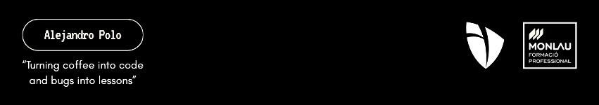

**Desarrollador apasionado por la tecnología.** 
Mi enfoque es el aprendizaje continuo, la resolución de desafíos complejos y la colaboración en proyectos que generen un impacto positivo.

---

## Tecnologías y Herramientas 💻

---

## Mis Estadísticas 📊

---
> *¡Gracias por visitar mi perfil! Siempre estoy abierto a colaborar en proyectos interesantes.*
